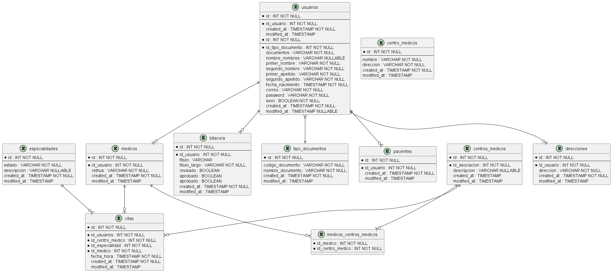

# api-softman
Api de prueba técnica para Softman

Versión 1.0.0

## Descripción General
API RESTful para la gestión de citas médicas, desarrollada con Spring Boot 3.4.2 y Java 17. Esta API permite gestionar pacientes, médicos, citas y especialidades médicas.

## Requisitos Técnicos
- Java 17
- Spring Boot 3.4.2
- Maven 4.0.0
- Base de datos H2 (Embedded). 


## Diagrama relacional de base de datos 



## Configuración del Proyecto

### Configuración de las bases de datos

La base de datos esta embebida en un archivo en la carpeta raíz del proyecto **citas-medicas.mv.db**

Esta ya cuenta con información como usuarios, roles, persmisos, estados de las citas, entre otros.

En caso de usar otra base de datos y querer los datos de pruebas, ejercutar los siguientes scripts en el orden mencionado

1.  **\src\main\resources\sql\Roles y Permisos.txt**

2.  **\src\main\resources\sql\Scripts.txt**


### Configuración de Base de Datos en archivo application.properties
```application.properties
spring.datasource.driverClassName=org.h2.Driver
spring.datasource.url=jdbc:h2:./citas-medicas
spring.datasource.username=test
spring.datasource.password=test
spring.jpa.database-platform=org.hibernate.dialect.H2Dialect
spring.jpa.hibernate.ddl-auto=update
spring.h2.console.enabled=true
spring.h2.console.path=/h2
```

### Dependencias principales
```xml
<dependencies>
	
		<!-- Spring boot starter web -->
		<dependency>
			<groupId>org.springframework.boot</groupId>
			<artifactId>spring-boot-starter-web</artifactId>
		</dependency>

		<!-- Spring boot starter test -->
		<dependency>
			<groupId>org.springframework.boot</groupId>
			<artifactId>spring-boot-starter-test</artifactId>
			<scope>test</scope>
		</dependency>
			
		<!-- Spring boot data jdbc -->
		<dependency>
			<groupId>org.springframework.boot</groupId>
			<artifactId>spring-boot-starter-data-jdbc</artifactId>
		</dependency>
		
		<!-- Spring boot starter jdbc -->
		<dependency>
			<groupId>org.springframework.boot</groupId>
			<artifactId>spring-boot-starter-jdbc</artifactId>
		</dependency>
		
		<!-- Spring boot starter data jpa -->
		<dependency>
			<groupId>org.springframework.boot</groupId>
			<artifactId>spring-boot-starter-data-jpa</artifactId>
		</dependency>

		<!-- Spring boot security -->
		<dependency>
			<groupId>org.springframework.boot</groupId>
			<artifactId>spring-boot-starter-security</artifactId>
		</dependency>
		
		<!-- Spring boot security test -->
		<dependency>
			<groupId>org.springframework.security</groupId>
			<artifactId>spring-security-test</artifactId>
			<scope>test</scope>
		</dependency>
		
		<!-- Spring boot Devtools -->
	    <dependency>
	        <groupId>org.springframework.boot</groupId>
	        <artifactId>spring-boot-devtools</artifactId>
	    </dependency>
		
		<!-- postgresql -->
		<dependency>
			<groupId>org.postgresql</groupId>
			<artifactId>postgresql</artifactId>
			<scope>runtime</scope>
		</dependency>
		
		<!-- h2 -->
		<dependency>
			<groupId>com.h2database</groupId>
			<artifactId>h2</artifactId>
			<scope>runtime</scope>
		</dependency>	
		
		
		<!-- Hibernate envers -->
		<dependency>
            <groupId>org.hibernate</groupId>
            <artifactId>hibernate-envers</artifactId>
            <version>6.4.2.Final</version>
        </dependency>
        
        <!-- Spring boot Starter Validation -->
		<dependency>
			<groupId>org.springframework.boot</groupId>
			<artifactId>spring-boot-starter-validation</artifactId>
		</dependency>
        
        <!-- OpenApi -->
    	<dependency>
		    <groupId>org.springdoc</groupId>
		    <artifactId>springdoc-openapi-starter-webmvc-ui</artifactId>
		    <version>2.2.0</version>
		</dependency>
		
		<!-- Gson -->
		<dependency>
		    <groupId>com.google.code.gson</groupId>
		    <artifactId>gson</artifactId>
		</dependency>
		
		<!-- Lombok -->
		<dependency>
	        <groupId>org.projectlombok</groupId>
	        <artifactId>lombok</artifactId>
    	</dependency>
		
		<!-- MapsStruct -->
		<dependency>
		    <groupId>org.mapstruct</groupId>
		    <artifactId>mapstruct</artifactId>
		    <version>1.5.2.Final</version>
		</dependency>
		<dependency>
		    <groupId>org.mapstruct</groupId>
		    <artifactId>mapstruct-processor</artifactId>
		    <version>1.5.2.Final</version>
		</dependency>
		
		<!-- Lombok MapsStruct -->
		<dependency>
		    <groupId>org.projectlombok</groupId>
		    <artifactId>lombok-mapstruct-binding</artifactId>
		    <version>0.2.0</version>
		</dependency>
		
		<dependency>
			<groupId>io.jsonwebtoken</groupId>
			<artifactId>jjwt-api</artifactId>
			<version>0.11.5</version>
		</dependency>
		<dependency>
			<groupId>io.jsonwebtoken</groupId>
			<artifactId>jjwt-impl</artifactId>
			<version>0.11.5</version>
		</dependency>
		<dependency>
			<groupId>io.jsonwebtoken</groupId>
			<artifactId>jjwt-jackson</artifactId>
			<version>0.11.5</version>
		</dependency>
        
	</dependencies>
```

### URL de Swagger
```Swagger
{baseUrl}/api/v1/swagger-ui/index.html#/
```

## Datos de prueba

### Login
**{{base_url}}/auth/login**

Request: (Datos de prueba)
```LoginRequest
{
    "correo": "mariasierra@correo.com",
    "password": "1234"
}
```
Response:
```LoginResponse
{
    "accessToken": "string",
    "refreshToken": "string"
}
```


## Códigos de Estado

- 200 OK: Petición exitosa
- 201 Created: Recurso creado exitosamente
- 400 Bad Request: Datos inválidos en la petición
- 401 Unauthorized: No autorizado
- 404 Not Found: Recurso no encontrado
- 409 Conflict: Conflicto con recursos existentes
- 500 Internal Server Error: Error del servidor

## Manejo de Errores

### Estructura de Error
```json
{
    "type": "Tipo de excepción",
    "message": "Mensaje de excepción",
    "exceptionClass": "Clase de dla excepción",
    "httpStatus": "Mensaje de estado http"
}
```
Ejemplo de estructura de error:
```json
{
    "type": "Business Exception",
    "message": "La franja para esta cita ya esta asignada",
    "exceptionClass": "class com.softman.exception.BusinessException",
    "httpStatus": "BAD_REQUEST"
}
```

## Seguridad
La API implementa autenticación mediante JWT (JSON Web Tokens). Cada petición debe incluir el token en el header:

```http
Authorization: Bearer <token>
```

## Versionado
La API utiliza versionado en la URL (/api/v1/). Los cambios importantes se reflejarán en nuevas versiones (/api/v2/, etc.).


### Postman Collection
[Descargar Postman Collection](Softman.postman_collection.json)

## Consideraciones de Despliegue
1. Configurar variables de entorno
2. Asegurar conexión a base de datos
3. Configurar CORS según necesidad
4. Revisar configuración de seguridad
5. Monitorear logs y métricas

## Soporte y Contacto
- Email: jabetancourt@hotmail.com
- Github: https://github.com/jabetancourtb/api-softman